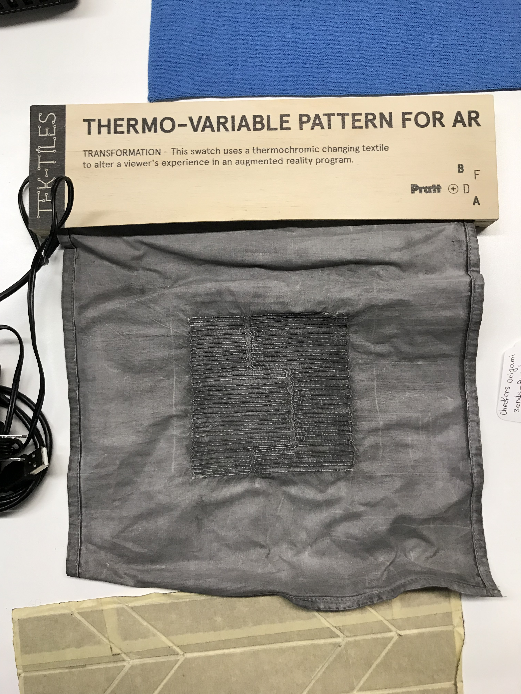

# Thermo-variable Pattern TEK-TILE

A thermochromic dye makes fabric respond to heat by turning white.
Digitally-controlled heaters sewn into the material then allow the overall
pattern to be controlled by a computer.

One application is in augmented reality. The pattern can be tracked in space by
a device's camera to allow digital graphics to be overlaid. By varying the
pattern a garment can then communicate with devices using it for augmented
reality effects.

[TEK-TILES](https://bkaccelerator.com/research-all/t-lab/tek-tiles/) is a
project from the
[Brooklyn Fashion and Design Accelerator](https://bkaccelerator.com/) to develop
examples of new textile technologies.

